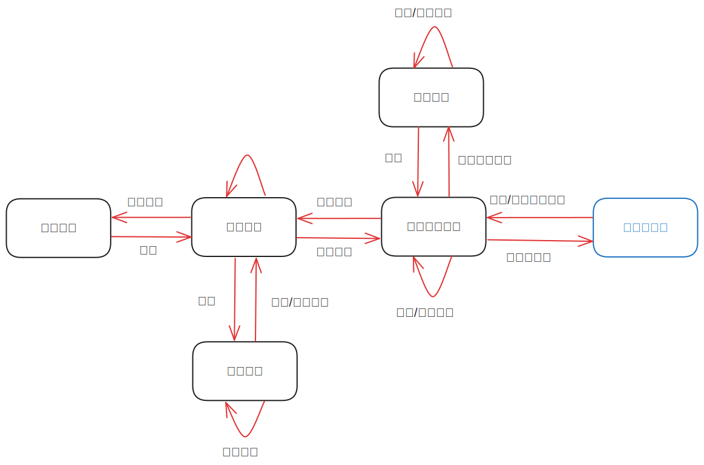

# Shwitter
清华大学软件学院春季学期课程《面向对象程序设计基础》大作业报告（2024 春）。

**目录**
- [Shwitter](#shwitter)
  - [作业描述](#作业描述)
  - [构建环境](#构建环境)
    - [IDE 以及编译器](#ide-以及编译器)
    - [操作系统](#操作系统)
  - [设计思路](#设计思路)
    - [数据库的表结构](#数据库的表结构)
      - [用户账号以及密码](#用户账号以及密码)
      - [关注列表](#关注列表)
      - [发布内容](#发布内容)
    - [页面跳转相关逻辑](#页面跳转相关逻辑)
    - [用户登录与注册相关逻辑](#用户登录与注册相关逻辑)
      - [登录](#登录)
      - [注册](#注册)
      - [退出登录](#退出登录)
    - [用户新增/删除关注相关逻辑](#用户新增删除关注相关逻辑)
    - [用户发表/删除动态相关逻辑](#用户发表删除动态相关逻辑)
    - [展示关注列表相关逻辑](#展示关注列表相关逻辑)
    - [展示其他用户动态相关逻辑](#展示其他用户动态相关逻辑)
  - [代码结构](#代码结构)
  - [具体实现](#具体实现)
  - [功能测试](#功能测试)
    - [登录和注册功能](#登录和注册功能)
    - [发布和删除动态功能](#发布和删除动态功能)
    - [关注其他用户功能](#关注其他用户功能)
  - [参考资料](#参考资料)
  - [作者信息](#作者信息)


## 作业描述

> 题目 4.27【***】简易社交媒体应用实现
>
> - 实现一个类似 Twitter 的社交媒体应用
> - 支持用户进行登录、注册、发布和删除内容
> - 支持不同用户之间相互关注，关注对方后可看对方发布内容

本项目实现了一个名为 *Shwitter* 的应用程序，满足以上要求，支持多用户同时在线，且能在本地利用数据库进行持久存储。

## 构建环境

### IDE 以及编译器

- IDE：Qt Creator 12.0.2 (Enterprise)
- 编译器：Qt 6.6.2 以及配套版本的 MinGW 编译器

最后需要使用 `Qt\6.6.2\mingw_64\bin` 目录下的 `windeployqt6.exe` 打包生成的可执行文件。

### 操作系统

Windows 规格：

|     条目     |                       内容                        |
| :----------: | :-----------------------------------------------: |
|     版本     |               Windows 11 家庭中文版               |
|     版本     |                       22H2                        |
|   安装日期   |                     2023/9/14                     |
| 操作系统版本 |                    22621.3296                     |
|     体验     | Windows Feature Experience Pack 1000.22687.1000.0 |

## 设计思路

### 数据库的表结构

#### 用户账号以及密码

对于每个用户而言，在注册时分配一个唯一标识符。表结构设计如下：唯一标识符、用户名、密码作为 `user` 表的三个字段，其中唯一标识符作为主键。

对应的 SQL 语句如下：

```sql
CREATE TABLE IF NOT EXISTS users (uuid UUID PRIMARY KEY, username VARCHAR(20), password VARCHAR(20))
```

#### 关注列表

对于每个用户而言，都有一个关注列表。表结构设计如下：某用户的唯一标识符、该用户关注的所有用户的唯一标识符构成的列表作为 `subscription` 表的两个字段，其中该用户的唯一标识符作为主键。

对应的 SQL 语句如下：

```sql
CREATE TABLE IF NOT EXISTS subscription (uuid UUID PRIMARY KEY, uuid_list JSONB)
```

#### 发布内容

对于每条动态而言，在发表时分配一个唯一标识符。该动态还应有表示发表时间的时间戳、发表者的唯一标识符、动态的内容。表结构设计如下：动态的唯一标识符、表示发表时间的时间戳、发表者的唯一标识符、动态的内容作为 `posts` 表的四个字段，其中动态的唯一标识符作为主键。

对应的 SQL 语句如下：

```sql
CREATE TABLE IF NOT EXISTS posts (post_uuid UUID PRIMARY KEY, timestamp DATETIME, poster_uuid UUID, post_content TEXT)
```

### 页面跳转相关逻辑



### 用户登录与注册相关逻辑

#### 登录

登录时在 `user` 表中查找是否有 `username` 和 `password` 均匹配的项。如果有，则登陆成功，将该用户的唯一标识符并存入 `global_user_uuid` 中，然后转入发表动态页面；否则，登录失败，弹出提示框，提示用户重新登录。

为了保证安全，即使是在数据库泄露的情况下也无法获得用户名对应的明文密码，本项目使用了 SHA256 的加密方式。数据库中仅存储密码经过 SHA256 后的值。在用户登录的时候也仅仅将用户输入的密码进行 SHA256 后再与数据库中的内容进行比对。

#### 注册

注册时：

- 首先检查注册的用户名以及密码是否合法，本程序要求
  - 用户名为长度为 1~20 的由字母、数字和下划线组成的字符串
  - 密码为长度 8~20 的由字母、数字和下划线组成的字符串
- 其次检查该用户名是否已被注册
- 最后检查两次输入的密码是否相同

如果上述检查均通过，则注册成功，在数据库中新增一项数据，并转入登录页面；否则注册失败，弹出提示框，提示用户重新注册。

#### 退出登录

将 `global_user_uuid` 清零并转入登录页面。

### 用户新增/删除关注相关逻辑

- 在点击“关注”按钮后，检查该用户名是否存在。如果存在，则弹出提示框，提示关注成功，并在数据库中添加此关注关系；否则关注失败，弹出提示框，提示用户重新关注。
- 在点击“取消关注”按钮后，弹出提示框，询问用户是否取消关注。如果是，则在数据库中删除此关注关系；否则不做任何操作。

此逻辑的重点在于**如何在数据库中添加/删除此关注关系**。

添加操作有三种情况：

- 如果以前此用户从未关注过其他用户，则数据库中不存在该项，只需要插入一项即可；
- 如果以前此用户关注过其他用户单位关注过此用户，则应从数据库中查询出原来的这项数据，在列表后追加此用户的唯一标识符，再更新至数据库中；
- 如果以前此用户已关注此用户，则跳过。

### 用户发表/删除动态相关逻辑

- 在用户发表一条新的动态后，在数据库中插入新的一项数据即可。
- 在用户点击某条动态的“删除”按钮后，弹出提示框，询问用户是否删除此动态。如果是，则在数据库中删除此项数据；否则不做任何操作。

### 展示关注列表相关逻辑

- 首先从数据库中获取当前用户的关注列表
- 然后在列表组件中填充数据

值得注意的是，每当当前用户执行关注/取消关注的操作后，都应重新更新并展示关注列表。

### 展示其他用户动态相关逻辑

- 首先从数据库中获取当前用户的关注列表
- 其次从数据库中获取该列表中所有用户的所有动态
- 最后在列表组件中填充这些数据

值得注意的是，每当当前用户执行发表/删除动态的操作后，都应重新更新并展示其他用户动态。

## 代码结构

```
- Shwitter
  - Shwitter.pro
  - Headers
    - customsubscriptionitemwidget.h
    - custompostitemwidget.h
    - login.h
    - post.h
    - postelement.h
    - postwindow.h
    - subscription.h
    - utils.h
    - widget.h
  - Sources
    - customsubscriptionitemwidget.cpp
    - custompostitemwidget.cpp
    - login.cpp
    - main.cpp
    - post.cpp
    - postelement.cpp
    - postwindow.cpp
    - subscription.cpp
    - utils.cpp
    - widget.cpp
  - Forms
    - widget.ui
```

- 类

  - `customsubscriptionitemwidget.h` 和 `customsubscriptionitemwidget.cpp`

    定义了 `CustomSubscriptionItemWidget` 类。该类定义了展示当前用户的关注列表时，关注列表的组件布局。

  - `custompostitemwidget.h` 和 `custompostitemwidget.cpp`

    定义了 `CostomPostItemWidget` 类。该类定义了展示当前用户关注的所有用户的所有动态时，展示动态的列表的组件布局。

  - `postelement.h` 和 `postelement.cpp`

    定义了 `PostElement` 类。该类定义了用户发表的动态的结构。具体而言，一个动态由以下部分组成：

    - 该动态的唯一标识符
    - 该动态的发表时间，以时间戳表示
    - 该动态的发表者
    - 该动态的内容

  - `postwindow.h` 和 `postwindow.cpp`

    定义了 `PostWindow` 类。该类定义了在用户发表新动态时，弹出输入发表内容的窗口，该窗口的布局。

  - `widget.h` 和 `widget.cpp`

    定义了 `Widget` 类。该类定义了整个应用程序窗口的布局。

- 函数库

  - `login.h` 和 `login.cpp`

    负责与数据库交互，管理用户登录注册相关操作。例如：

    - 判断用户名和密码是否正确

  - `post.h` 和 `post.cpp`

    负责与数据库交互，管理用户动态相关操作。例如：

    - 插入/删除某一条用户动态
    - 获取当前用户关注的所有用户的所有动态

  - `subscription.h` 和 `subscription.cpp`

    负责与数据库交互，管理用户关注其他用户相关操作。例如：

    - 新增/删除关注某个用户
    - 获取当前用户关注的所有用户组成的列表

  - `utils.h` 和 `utils.cpp`

    辅助函数库，它负责定义一些常用的、能使代码组织结构更清晰的功能函数。例如：

    - 判断用户名是否合法
    - 判断密码是否合法
    - 计算一个字符串的 SHA256 值
    - 将 `QStringList` 转换为 `QJsonDocument`
    - 将 `QJsonDocument` 转换为 `QStringList`
    - 判断一个用户名是否存在
    - 由用户唯一标识符得到用户名

- `main.cpp`

- 界面文件

  - `widget.ui`

    界面文件，描述了本项目的应用界面 UI。

- `Shwitter.pro`

  项目文件，它描述了 Qt 项目的配置和组织结构。本项目使用 QMake (Qt Make) 作为构建系统，`Shwitter.pro` 中包含了构建项目所需的信息，如源文件列表、编译选项、依赖关系等。

## 具体实现

具体实现见代码文件中的注释。

## 功能测试

### 登录和注册功能

### 发布和删除动态功能

### 关注其他用户功能

## 参考资料

1. [*Qt Documentation | Home*](https://doc.qt.io/): https://doc.qt.io/
1. [*STL or Qt containers? - Stack Overflow*](https://stackoverflow.com/questions/1668259/stl-or-qt-containers): https://stackoverflow.com/questions/1668259/stl-or-qt-containers
1. [*What does the Q_OBJECT macro do? Why do all Qt objects need this macro? - Stack Overflow*](https://stackoverflow.com/questions/1368584/what-does-the-q-object-macro-do-why-do-all-qt-objects-need-this-macro): https://stackoverflow.com/questions/1368584/what-does-the-q-object-macro-do-why-do-all-qt-objects-need-this-macro

## 作者信息

- 姓名：
- 学号：
- Email：
- 手机：
